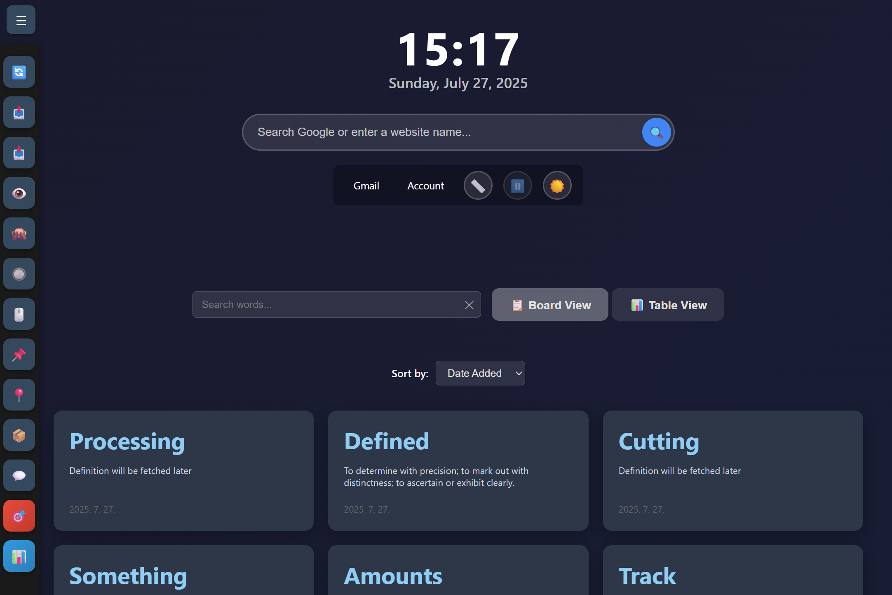

# 📚 Vocabulary Learning Note

A Chrome extension for vocabulary learning with interactive quizzes, progress tracking, and smart word management.

## 🌟 Features

### Core Features
- **Word Save to Note**: Save words while browsing with `Ctrl+Shift+S`
- **Automatic Definitions**: Fetch definitions from Dictionary API
- **Interactive Card**: Toggle hide/show card word and define
- **Quiz Progress Tracking**: Daily streaks and statistics
- **Pin/Unpin Words**: Mark important words for quick access
- **Archive System**: Archive words you've mastered
- **Related/Opposite Words**: Discover synonyms using Datamuse API
- **CSV Export/Import**: Export vocabulary to CSV and import from CSV files
- **PDF Integration**: Save words from PDF documents using PDF.js viewer
- **View Modes**: Board view and table view
- **New Tab Override**: Customizable new tab page with vocabulary board
- **Hide All Words/Definitions**: Global toggle modes for focused learning
- **Multiple Word Selection**: Select and save multiple words at once when Highlight mode is enabled

## 🚀 Installation

1. Clone or download this repository
2. Open Chrome and go to `chrome://extensions/`
3. Enable "Developer mode"
4. Click "Load unpacked" and select the extension folder

## 🎯 Usage

### Basic Usage
1. **Save Words**: Select any word and press `Ctrl+Shift+S`
2. **View Vocabulary**: Open a new tab to see your vocabulary board
4. **Search**: Use the search bar to find specific words

### Quiz System
1. Click "🎯 Start Quiz" button
2. Choose quiz type (Definition to Word or Word to Definition)
3. Answer 5 questions
4. View your score and progress

### Import/Export
- **Export**: Click "📤 Export" to download vocabulary as CSV
- **Import**: Click "📥 Import" to load vocabulary from CSV file

## 📄 PDF Support

This extension includes PDF.js integration for enhanced PDF reading:

- **Automatic PDF Redirection**: PDF files automatically open in PDF.js viewer
- **Text Selection**: Select and save words directly from PDF documents
- **Settings Control**: Toggle PDF auto-redirection in settings

**Note**: When you open a PDF file, it will automatically redirect to the PDF.js viewer for better text selection capabilities. You can disable this feature in the settings.

## ⌨️ Keyboard Shortcuts

- `Ctrl+Shift+S`: Save selected word
- `R`: Refresh vocabulary board
- `Ctrl+A`: Toggle animations
- `Ctrl+Q`: Start quiz

## 🔧 Configuration

- **Dark Mode**: Click 🌙/☀️ button to toggle
- **Animations**: Click 🎬 button to toggle
- **Settings**: Click ⚙️ button for advanced settings
- **PDF Auto-redirect**: Toggle in settings
- **All data stored locally**: No server required

## 🏗️ Technical Details

### Architecture
- **Frontend**: Vanilla JavaScript (ES6+)
- **Storage**: Chrome Storage API
- **APIs**: Dictionary API, Datamuse API
- **PDF Viewer**: Mozilla PDF.js integration
- **Build**: Node.js with archiver

## 🔒 Privacy & Security

- **Local Storage**: All data stored locally in Chrome
- **Permissions**: This extension requires "tabs" permission to access the currently active tab for word saving functionality. This permission is necessary to read selected text from web pages when you press Ctrl+Shift+S. No browsing history or personal data is collected or transmitted.

## 🔮 Future Work

### Smart Vocabulary Management
- **Automatic Word Categorization**: AI-powered classification of words into different categories (academic, casual, technical, etc.)
- **Dynamic Word Sets**: Create multiple vocabulary books for different purposes
- **Daily Word Rotation**: Show N different words each day from various categories
- **Spaced Repetition System**: Implement forgetting curve-based review scheduling
- **Adaptive Learning**: Adjust difficulty based on user performance

### Enhanced Learning Features
- **Pronunciation Guide**: Audio pronunciation for saved words
- **Context Examples**: Save words with their original context
- **Learning Analytics**: Detailed progress reports and learning insights
- **Social Features**: Share vocabulary lists with other learners
- **Offline Mode**: Full functionality without internet connection

## 📝 License

Apache-2.0 License - see LICENSE file for details.

## 🙏 Acknowledgments

- Dictionary API for word definitions
- Datamuse API for word relationships and synonyms
- Mozilla PDF.js for PDF viewing

**Note**: This extension uses the Datamuse API for finding related words and synonyms. The Datamuse API is freely available and does not require an API key.

---

*<small>This project is a simple side project created using Cursor.</small>*
